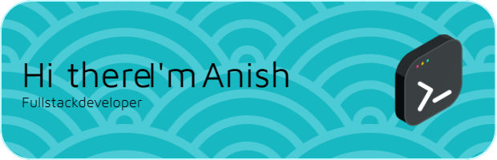

# 📖 About Me
🌱 Currently developing in brightscript 🔮 Attempting to use Vim now   👨‍💻 Soon to be Leetcode wizard  ✨ One Piece consumer  
📫 How to reach me:
 - Email: **`anish.shah1803@gmail.com`**

---

### 💻 Languages and Tools

 

#

### 📊 GitHub Stats
<!-- 

&nbsp;
&nbsp;

 -->

 
 

#

### 🚧 Projects

# 
### 🌐 Connect with me:
  
#

 
  Visitor count 
  

